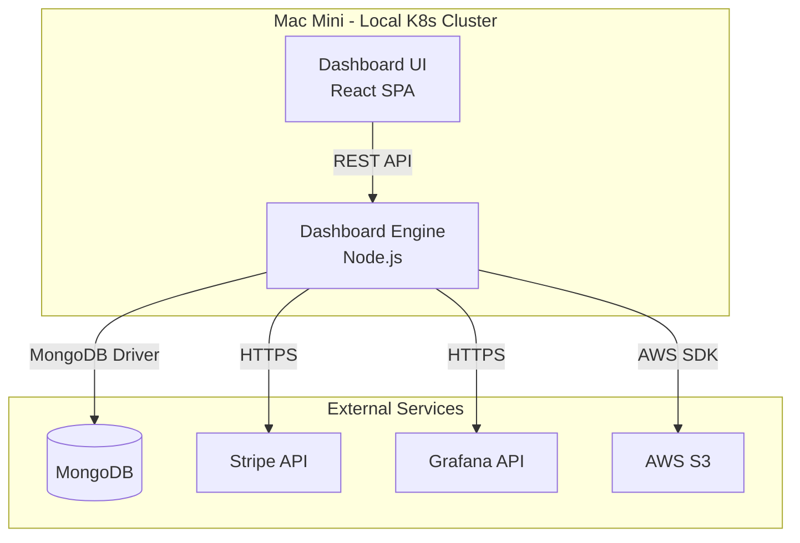
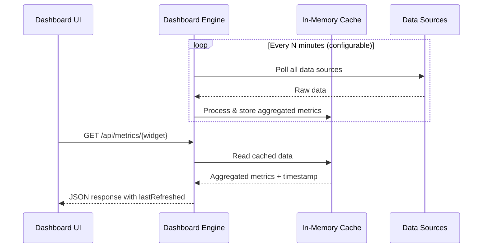
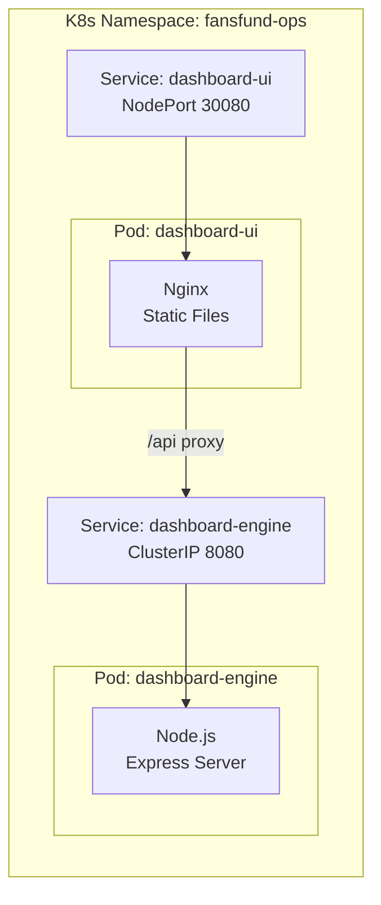

# Design Document: Ops Dashboard

## Overview

The ops-dashboard is a full-stack operational dashboard for the FansFund team. It consolidates real-time business metrics from four external data sources (MongoDB, Stripe, Grafana, AWS S3) into a single branded interface displayed on a 25" monitor (1920x1080) connected to a Mac Mini running in a local Kubernetes cluster.

The system is composed of two main deployable units:
1. **Dashboard UI** — A React single-page application rendered in a browser (kiosk mode) on the Mac Mini
2. **Dashboard Engine** — A Node.js backend service that aggregates data from all four sources and serves it to the UI via a REST API

Both units are containerized and deployed to the local K8s cluster. The architecture prioritizes simplicity, maintainability for a small team, and resilience to upstream API failures.

### Key Design Decisions

| Decision | Choice | Rationale |
|----------|--------|-----------|
| Frontend framework | React + TypeScript | Mature ecosystem, strong typing, excellent grid layout libraries |
| Grid layout | react-grid-layout | Drag-and-drop, resize, responsive breakpoints, local storage persistence |
| Styling | Tailwind CSS | Utility-first, easy to enforce brand tokens, dark-mode first |
| Backend runtime | Node.js + TypeScript | Shared language with frontend, async I/O fits polling pattern |
| API layer | Express.js | Lightweight, well-understood, sufficient for internal dashboard |
| Data caching | In-memory (Node.js Map) | Simple, low-latency, adequate for single-instance deployment |
| Deployment | Docker containers on local K8s | Matches existing infrastructure on Mac Mini |
| Fonts | Self-hosted Work Sans + Outfit (woff2) | Avoids external CDN dependency for air-gapped/local network |

---

## Architecture

### System Context Diagram



### Data Flow



### Deployment Architecture



The UI pod serves the static React build via Nginx and proxies `/api/*` requests to the Engine service. The Engine pod handles all external integrations and caching.

---

## Components and Interfaces

### Frontend Components

#### 1. DashboardShell
The root layout component. Manages the overall grid, header, and global state.

```typescript
interface DashboardShellProps {
  config: DashboardConfig;
  onConfigChange: (config: DashboardConfig) => void;
}
```

#### 2. WidgetGrid
Wraps `react-grid-layout` to manage widget positioning, drag-drop, and resize.

```typescript
interface WidgetGridProps {
  layout: LayoutItem[];
  widgets: WidgetDefinition[];
  onLayoutChange: (layout: LayoutItem[]) => void;
}
```

#### 3. Widget (Abstract)
Base component that provides common widget chrome: title bar, last-refreshed timestamp, loading indicator, error state, stale-data indicator, and manual refresh button.

```typescript
interface WidgetProps {
  title: string;
  lastRefreshed: string | null; // ISO 8601
  isLoading: boolean;
  error: string | null;
  isStale: boolean;
  onRefresh: () => void;
  children: React.ReactNode;
}
```

#### 4. Concrete Widgets
- `RevenueWidget` — Displays gross/net/fees for day/week/month
- `PaymentCountWidget` — Success/failed/refund counts
- `UserGrowthWidget` — Creator/Fan totals and new registrations
- `SystemHealthWidget` — Service status, uptime, error rate, latency
- `DisputeCountdownWidget` — Days until nearest deadline, dispute list
- `DisputeProgressWidget` — Two-step progress indicators per dispute
- `TransactionFeedWidget` — Scrollable list of recent payments
- `PlatformSummaryWidget` — Lifetime volume, take rate, dispute rate

#### 5. ConfigPanel
A slide-out panel for adding/removing widgets and adjusting refresh interval.

### Backend Components

#### 1. DataAggregator (Scheduler)
Orchestrates periodic data refresh from all sources. Configurable interval (1–60 min, default 5 min). Runs each source collector in parallel with independent timeout handling.

```typescript
interface AggregatorConfig {
  refreshIntervalMinutes: number; // 1-60, default 5
  sourceTimeoutMs: number; // default 10000
}
```

#### 2. Source Collectors
Each collector is responsible for one external data source:

```typescript
interface SourceCollector<T> {
  name: string;
  collect(): Promise<CollectorResult<T>>;
}

interface CollectorResult<T> {
  data: T;
  collectedAt: string; // ISO 8601
  durationMs: number;
}
```

Implementations:
- `StripeCollector` — Revenue, payments, disputes, recent transactions
- `MongoCollector` — User/Creator counts and growth
- `GrafanaCollector` — Service health, uptime, alerts
- `S3Collector` — Dispute evidence file checks

#### 3. MetricsCache
In-memory store keyed by widget/metric type. Retains last-successful data to serve during source failures.

```typescript
interface CacheEntry<T> {
  data: T;
  lastRefreshed: string; // ISO 8601
  error: string | null;
  isStale: boolean;
}
```

#### 4. API Router
RESTful endpoints serving cached metrics to the UI:

| Endpoint | Method | Description |
|----------|--------|-------------|
| `GET /api/metrics/revenue` | GET | Revenue & payment metrics |
| `GET /api/metrics/users` | GET | User/Creator growth |
| `GET /api/metrics/health` | GET | System health from Grafana |
| `GET /api/metrics/disputes` | GET | Dispute deadlines + progress |
| `GET /api/metrics/transactions` | GET | Recent transaction feed |
| `GET /api/metrics/summary` | GET | Platform summary numbers |
| `GET /api/config` | GET | Current refresh config |
| `PUT /api/config` | PUT | Update refresh interval |
| `POST /api/refresh` | POST | Trigger manual refresh (all) |
| `POST /api/refresh/:widget` | POST | Trigger manual refresh (single) |

### Integration Interfaces

#### Stripe Integration
- **SDK**: `stripe` npm package
- **Auth**: API secret key via K8s Secret
- **Endpoints used**: Balance Transactions, Charges, Disputes, Payment Intents
- **Rate limiting**: Stripe allows 100 read requests/second; our 5-min polling is well within limits
- **Incremental aggregation**: revenue and payment-count metrics are aggregated incrementally into a per-UTC-day store (`StripeAggregateStore`). The first poll after startup backfills the current reporting window; each subsequent poll fetches only balance transactions/charges created since the last sync (minus an overlap window, de-duplicated by id) and folds them into the running day buckets. Period metrics (day/week/month) are computed by summing the relevant buckets, so steady-state polls stay fast regardless of monthly volume. The recent-transactions feed is a small fixed-size query. Disputes are fetched fresh each poll (dispute status is mutable) but bounded to a recent lookback window (default 180 days) so years of closed disputes are never paginated — open disputes and the current month always fall well inside that window.
- **Refund counting**: refunds are counted from balance transactions of type `refund` (refund *events*), not from a charge's mutable `refunded` flag — this keeps the aggregation incremental and counts a refund in the period it actually occurs.

#### MongoDB Integration
- **Driver**: `mongodb` npm package (native driver)
- **Auth**: Connection string via K8s Secret
- **Collections**: `users` (with `role` field for Creator/Fan), `payments`
- **Queries**: Count aggregations with date filters

#### Grafana Integration
- **Method**: Grafana HTTP API (`/api/health`, `/api/datasources/proxy`, `/api/alerts`)
- **Auth**: API key via K8s Secret
- **Data**: Service status, uptime metrics from Prometheus datasource queries

#### AWS S3 Integration
- **SDK**: `@aws-sdk/client-s3` (v3)
- **Auth**: IAM credentials via K8s Secret (or IRSA if available). Optionally assumes an IAM role via STS (`sts:AssumeRole`) when `AWS_ROLE_ARN` is set, using the base credentials to obtain auto-refreshing temporary credentials for the bucket.
- **Bucket**: `fans-fund-me-core-dispute-docs`
- **Operations**: `ListObjectsV2` to check for evidence files at `batches/<number>/<payment-id>/`

---

## Data Models

### Frontend Models

```typescript
// Dashboard configuration persisted in localStorage
interface DashboardConfig {
  version: number;
  refreshIntervalMinutes: number;
  layout: LayoutItem[];
  widgets: WidgetInstance[];
}

interface LayoutItem {
  i: string;    // widget instance ID
  x: number;   // grid column
  y: number;   // grid row
  w: number;   // width in grid units
  h: number;   // height in grid units
  minW?: number;
  minH?: number;
}

interface WidgetInstance {
  id: string;
  type: WidgetType;
  visible: boolean;
}

type WidgetType =
  | 'revenue'
  | 'payment-counts'
  | 'user-growth'
  | 'system-health'
  | 'dispute-countdown'
  | 'dispute-progress'
  | 'transaction-feed'
  | 'platform-summary';
```

### Backend / API Response Models

```typescript
// Revenue & Payment Metrics (Req 3)
interface RevenueMetrics {
  periods: {
    day: PeriodMetrics;
    week: PeriodMetrics;
    month: PeriodMetrics;
  };
  lastRefreshed: string;
}

interface PeriodMetrics {
  grossRevenue: string;    // USD, 2dp e.g. "1234.56"
  netRevenue: string;
  totalFees: string;
  successfulPayments: number;
  failedPayments: number;
  refunds: number;
  averagePayment: string | null; // null = "N/A"
}

// User Growth Metrics (Req 4)
interface UserGrowthMetrics {
  totalCreators: number;
  totalFans: number;
  periods: {
    day: GrowthPeriod;
    week: GrowthPeriod;
    month: GrowthPeriod;
  };
  lastRefreshed: string;
}

interface GrowthPeriod {
  newCreators: number;
  newFans: number;
  activeCreators: number;
}

// System Health Metrics (Req 5)
interface SystemHealthMetrics {
  services: ServiceHealth[];
  apiMetrics: {
    errorRatePerMinute: number;
    avgLatencyMs: number;
  };
  lastRefreshed: string;
}

interface ServiceHealth {
  name: string;
  status: 'healthy' | 'degraded' | 'down';
  uptime24h: string;     // percentage "99.95"
  uptime7d: string;
  alertFiring: boolean;
  lastUpdated: string;   // ISO 8601
}

// Dispute Metrics (Req 6 & 7)
interface DisputeMetrics {
  nearestDeadlineDays: number | null; // null = no open disputes
  disputes: DisputeItem[];
  lastRefreshed: string;
}

interface DisputeItem {
  paymentId: string;         // Stripe payment-intent id (pi_...), keys the S3 evidence folder; falls back to charge id
  amountUsd: string;         // "45.00" (USD, the platform's business currency)
  daysRemaining: number;     // negative = overdue
  evidenceUploaded: boolean;
  evidenceSubmitted: boolean;
  evidenceBatch: number | null; // S3 batch folder number holding the evidence, or null when none found
  status: DisputeStatus;
}

type DisputeStatus =
  | 'warning_needs_response'
  | 'warning_under_review'
  | 'needs_response'
  | 'under_review'
  | 'won'
  | 'lost'
  | 'charge_refunded';

// Transaction Feed (Req 9)
interface TransactionFeedMetrics {
  transactions: TransactionItem[];
  lastRefreshed: string;
}

interface TransactionItem {
  idSuffix: string;       // last 4 chars prefixed with "…"
  amount: string;         // original currency, 2dp
  currency: string;       // ISO 4217
  timestamp: string;      // ISO 8601 with timezone
}

// Platform Summary (Req 10)
interface PlatformSummaryMetrics {
  monthlyGrossVolume: string;   // USD, 2dp — gross volume processed month-to-date
  monthlyTakeRate: string | null; // percentage or null for "N/A"
  openDisputes: number;
  monthlyDisputeRate: string;    // percentage "0.15"
  monthlyPaymentCount: number;
  lastRefreshed: string;
}
```

### Cache Model

```typescript
interface MetricsStore {
  revenue: CacheEntry<RevenueMetrics>;
  users: CacheEntry<UserGrowthMetrics>;
  health: CacheEntry<SystemHealthMetrics>;
  disputes: CacheEntry<DisputeMetrics>;
  transactions: CacheEntry<TransactionFeedMetrics>;
  summary: CacheEntry<PlatformSummaryMetrics>;
}

interface CacheEntry<T> {
  data: T | null;
  lastRefreshed: string | null;
  lastError: string | null;
  isRefreshing: boolean;
}
```

---


## Correctness Properties

*A property is a characteristic or behavior that should hold true across all valid executions of a system — essentially, a formal statement about what the system should do. Properties serve as the bridge between human-readable specifications and machine-verifiable correctness guarantees.*

### Property 1: Dashboard configuration round-trip

*For any* valid `DashboardConfig` object (with arbitrary widget types, positions, sizes, and refresh interval), serializing to JSON and storing in localStorage, then reading and deserializing, SHALL produce an object deeply equal to the original.

**Validates: Requirements 2.2**

### Property 2: Invalid widget type removal preserves valid widgets

*For any* saved `DashboardConfig` containing a mix of valid and invalid widget types, loading the configuration SHALL produce a layout containing exactly the valid widgets in their original positions, with no invalid widget types present.

**Validates: Requirements 2.5**

### Property 3: Widget operations maintain grid constraints

*For any* sequence of add, remove, reorder, and resize operations applied to a valid grid layout, the resulting layout SHALL have every widget with dimensions within [1×1, maxColumns×maxRows] and positioned within the grid boundaries.

**Validates: Requirements 2.1**

### Property 4: Monetary value formatting

*For any* numeric monetary value (including zero, fractional pennies, and large values), the formatting function SHALL produce a string representation with exactly two decimal places matching the pattern `/^\d+\.\d{2}$/`.

**Validates: Requirements 3.1, 6.3, 9.1, 10.1, 10.3**

### Property 5: Time-bounded revenue aggregation

*For any* set of Stripe balance transactions with arbitrary amounts and timestamps, the revenue aggregation for a given UTC time period (day/week/month) SHALL produce a gross total equal to the sum of amounts of transactions whose timestamps fall within that period's boundaries.

**Validates: Requirements 3.1, 3.2**

### Property 6: Payment count aggregation

*For any* set of payments with arbitrary statuses (succeeded/failed/refunded) and timestamps, the count for each status within a given UTC time period SHALL equal the number of payments matching that status whose timestamps fall within the period boundaries.

**Validates: Requirements 3.2, 10.4**

### Property 7: Average payment with division-by-zero safety

*For any* non-negative gross revenue value and non-negative payment count, the average calculation SHALL return gross/count rounded to 2 decimal places when count > 0, and SHALL return null when count equals zero.

**Validates: Requirements 3.3**

### Property 8: User count aggregation by role and time boundary

*For any* set of user records with roles (Creator/Fan) and registration timestamps, the total count per role SHALL equal the count of records matching that role, and the new count within a time period SHALL equal the count of records matching that role registered within the UTC period boundaries.

**Validates: Requirements 4.1, 4.2**

### Property 9: Active creator detection

*For any* set of creators and payments, the active creator count for a time period SHALL equal the count of distinct creators who have at least one successful payment with a timestamp within that period's UTC boundaries.

**Validates: Requirements 4.3**

### Property 10: Service health status classification

*For any* set of Grafana metric values for a service, the health classification function SHALL return exactly one of ('healthy', 'degraded', 'down') based on defined thresholds, and the classification SHALL be deterministic (same inputs always produce same output).

**Validates: Requirements 5.1**

### Property 11: Uptime and rate metric calculations

*For any* set of uptime measurements (total seconds, downtime seconds) and error/latency measurements, the uptime percentage SHALL equal ((total - downtime) / total × 100) rounded to 2 decimal places, the error rate SHALL equal (error count / minutes), and average latency SHALL equal (sum of latencies / measurement count).

**Validates: Requirements 5.2, 5.3**

### Property 12: Stale data detection

*For any* cache entry with a lastUpdated timestamp and any current time, the isStale flag SHALL be true if and only if the difference between current time and lastUpdated exceeds 120 seconds.

**Validates: Requirements 5.7**

### Property 13: Dispute days remaining calculation

*For any* dispute with an evidence_due_by UTC timestamp and any current UTC time, the daysRemaining calculation SHALL equal the number of calendar days from the current date to the due date (negative when past due), using UTC date boundaries for day counting.

**Validates: Requirements 6.1**

### Property 14: Dispute urgency classification

*For any* integer daysRemaining value, the urgency classification SHALL return 'overdue' when daysRemaining < 0, 'critical' when daysRemaining ≤ 1 and ≥ 0, 'urgent' when daysRemaining ≤ 3 and > 1, and 'normal' when daysRemaining > 3.

**Validates: Requirements 6.4, 6.5, 6.7**

### Property 15: Dispute list ordering

*For any* set of open disputes with arbitrary deadline dates, the formatted dispute list SHALL be sorted in ascending order by daysRemaining (soonest deadline first).

**Validates: Requirements 6.3**

### Property 16: Evidence upload detection

*For any* S3 file listing response (including empty listings, listings with zero-byte files only, and listings with at least one file > 0 bytes), the evidence upload status SHALL be true if and only if at least one file in the listing has a size greater than zero bytes.

**Validates: Requirements 7.1, 7.2, 7.3**

### Property 17: Dispute progress step classification

*For any* combination of (evidenceUploaded: boolean, disputeStatus: DisputeStatus), the progress determination SHALL mark both steps complete when status is 'under_review', 'won', or 'lost'; SHALL mark Evidence_Submission as outstanding when evidenceUploaded is true AND status is 'needs_response' or 'warning_needs_response'; and SHALL mark Evidence_Upload as outstanding when evidenceUploaded is false AND status indicates the dispute is open.

**Validates: Requirements 7.4, 7.5**

### Property 18: Open dispute status filter

*For any* DisputeStatus value, the isOpen predicate SHALL return true for 'warning_needs_response' and 'needs_response', and SHALL return false for 'warning_under_review', 'under_review', 'won', 'lost', and 'charge_refunded'.

**Validates: Requirements 7.7**

### Property 19: Refresh interval clamping

*For any* numeric input value for refresh interval, the validated interval SHALL be clamped to the range [1, 60] minutes, returning 1 for values below 1, 60 for values above 60, and the input value (rounded to nearest integer) for values within range. Non-numeric or undefined inputs SHALL default to 5.

**Validates: Requirements 8.1**

### Property 20: Duplicate refresh prevention

*For any* sequence of refresh requests issued while a refresh is already in progress, the system SHALL execute exactly one refresh operation and discard all duplicate requests until the in-progress refresh completes.

**Validates: Requirements 8.4**

### Property 21: Transaction ID truncation

*For any* Stripe payment ID string of length ≥ 4, the formatted ID suffix SHALL equal "…" concatenated with the last 4 characters of the original ID, and SHALL not contain any other characters from the original ID.

**Validates: Requirements 9.1**

### Property 22: Transaction feed ordering

*For any* set of transactions with arbitrary timestamps, the formatted feed SHALL be sorted in descending order by timestamp (most recent first), limited to at most 20 items.

**Validates: Requirements 9.1, 9.2**

### Property 23: No PII in transaction output

*For any* payment record containing PII fields (fan name, creator name, email, full payment ID, billing address), the formatted transaction feed item SHALL not contain any of those PII field values as substrings.

**Validates: Requirements 9.4**

### Property 24: Take rate calculation

*For any* non-negative platform fees value and non-negative gross volume value, the take rate SHALL equal (fees / volume × 100) rounded to 2 decimal places when volume > 0, and SHALL return null when volume equals zero.

**Validates: Requirements 10.2**

### Property 25: Dispute rate calculation

*For any* non-negative dispute count and non-negative payment count, the dispute rate SHALL equal (disputes / payments × 100) rounded to 2 decimal places when payments > 0, and SHALL return "0.00%" when payments equals zero.

**Validates: Requirements 10.3**

---

## Error Handling

### Strategy by Layer

#### Data Source Failures (Backend)

| Scenario | Behavior |
|----------|----------|
| Source timeout (>10s) | Mark source as errored, retain last cached data, log warning |
| Source HTTP error (4xx/5xx) | Same as timeout — cache retains last good data |
| Source returns malformed data | Log error with payload sample, mark errored, retain cache |
| All sources fail simultaneously | Each source handled independently; UI shows per-widget errors |

#### Cache Behavior on Failure

- Cache entries are never cleared on error — only overwritten on success
- `lastError` field stores the most recent error message and timestamp
- `isStale` computed from `lastRefreshed` vs current time (threshold: 120s for health, configurable for others)
- On recovery, error state is cleared and fresh data replaces cache

#### Frontend Error States

| Scenario | UI Behavior |
|----------|-------------|
| API request fails | Show error indicator on affected widget, display last-known data |
| API returns error for one widget | Only that widget shows error; others unaffected |
| API returns stale data | Show stale-data indicator (⚠ icon + "Last updated: X min ago") |
| localStorage corrupt/unavailable | Fall back to default config, log warning to console |
| Font load failure | System sans-serif fallback after 3s timeout (`font-display: swap`) |
| Widget type no longer available | Remove from layout, render remaining widgets normally |

#### Retry Strategy

- No automatic retry on individual source failures — next scheduled poll will attempt again
- Manual refresh available per-widget or globally
- Exponential backoff not needed given the fixed polling interval (1–60 min)

### Logging

- Backend logs structured JSON to stdout (picked up by K8s logging)
- Log levels: `error` (source failures), `warn` (stale data), `info` (refresh cycles), `debug` (timing)
- No PII in logs (payment IDs truncated same as UI)

---

## Testing Strategy

### Unit Tests (Example-Based)

Unit tests cover specific scenarios, edge cases, and visual behavior:

- **Brand rendering**: Verify CSS computed values match spec (contrast, fonts, sizes)
- **Responsive layout**: Check no overflow at breakpoints (1024, 1920, 2560, 3840, 5120)
- **Default config loading**: Verify all widgets present when localStorage empty
- **Font fallback**: Simulate load failure, verify system font applied
- **Alert highlighting**: Verify accent color applied when `alertFiring=true`
- **Error states**: Simulate API failures, verify indicators and cached data display
- **Loading states**: Verify indicators during refresh
- **Stale indicators**: Verify visual indicator when data exceeds staleness threshold
- **Progress UI**: Verify two-step progress labels rendered correctly

### Property-Based Tests

Property-based tests validate universal correctness across generated inputs. Each property test runs a minimum of 100 iterations.

**Library**: `fast-check` (TypeScript/JavaScript PBT library)

**Configuration**:
- Minimum 100 iterations per property
- Each test tagged with: `Feature: ops-dashboard, Property {N}: {title}`
- Generators produce edge cases: empty arrays, zero values, boundary timestamps, negative days, unicode strings

**Properties to implement** (referencing design properties 1–25):
- Configuration round-trip (Property 1)
- Invalid widget removal (Property 2)
- Grid constraint maintenance (Property 3)
- Monetary formatting (Property 4)
- Revenue aggregation (Property 5)
- Payment count aggregation (Property 6)
- Average calculation (Property 7)
- User count aggregation (Property 8)
- Active creator detection (Property 9)
- Health status classification (Property 10)
- Metric calculations (Property 11)
- Stale data detection (Property 12)
- Days remaining calculation (Property 13)
- Urgency classification (Property 14)
- Dispute ordering (Property 15)
- Evidence upload detection (Property 16)
- Progress step classification (Property 17)
- Open status filter (Property 18)
- Interval clamping (Property 19)
- Duplicate refresh prevention (Property 20)
- Transaction ID truncation (Property 21)
- Transaction feed ordering (Property 22)
- No PII leakage (Property 23)
- Take rate calculation (Property 24)
- Dispute rate calculation (Property 25)

### Integration Tests

Integration tests verify external service connectivity and data flow:

- **Stripe**: Verify balance transaction retrieval, dispute listing, charge queries
- **MongoDB**: Verify user count aggregation queries return expected shape
- **Grafana**: Verify health API response parsing and alert detection
- **S3**: Verify ListObjectsV2 correctly identifies evidence files
- **End-to-end refresh cycle**: Verify scheduler triggers all collectors and updates cache

### Test Infrastructure

- **Frontend**: Vitest + React Testing Library + jsdom
- **Backend**: Vitest for unit/property tests
- **PBT**: fast-check integrated with Vitest
- **Integration**: Vitest with test containers or mock servers
- **CI**: All tests run in K8s Job before deployment; property tests included in CI pipeline
